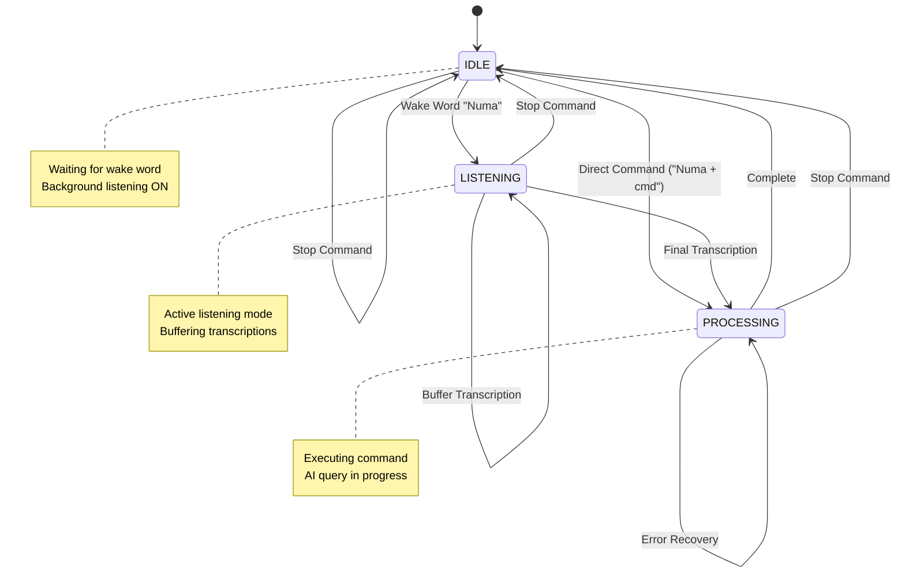
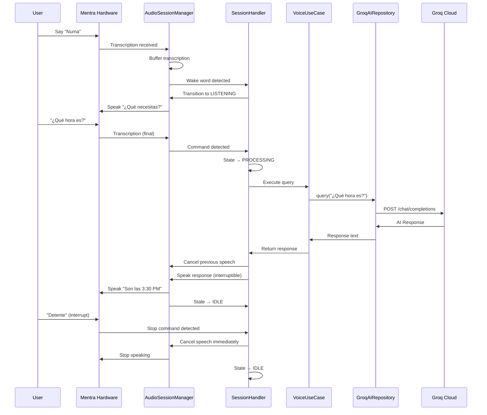
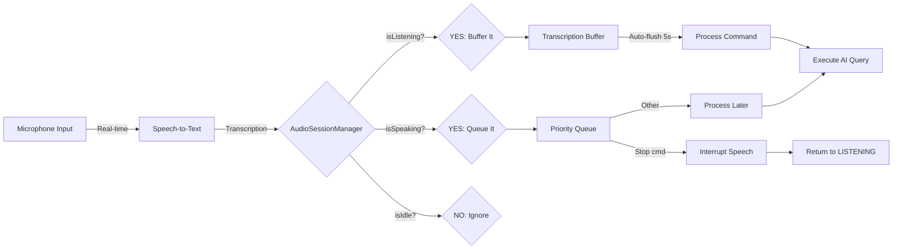
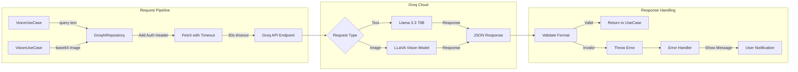
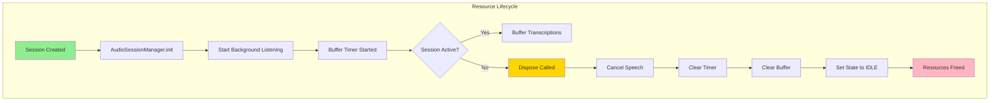
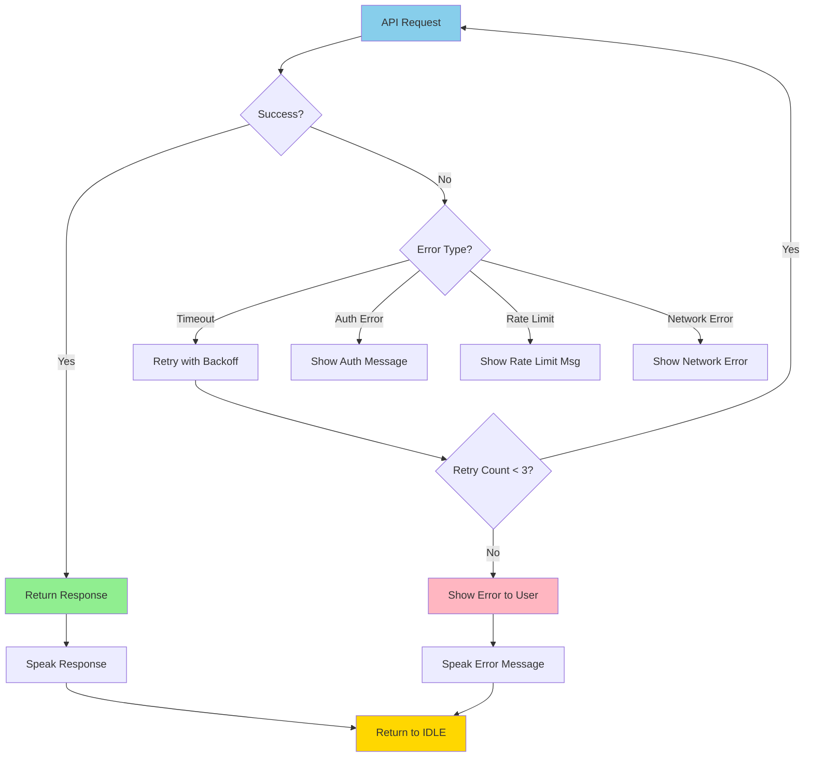

# Numa AI Architecture - Optimized for Background Audio & Groq

## System Architecture Diagram

```mermaid
graph TB
    subgraph "Mentra Glasses Hardware"
        A[Microphone] -->|Audio Stream| B[Mentra SDK]
        C[Camera] -->|Photo Buffer| B
        D[Speakers] <--|Audio Output| B
        E[Display] <--|Text/UI| B
    end
    
    subgraph "Numa AI Application"
        B --> F[SessionHandler]
        F --> G[AudioSessionManager]
        F --> H[VoiceAssistantUseCase]
        F --> I[VisionAssistantUseCase]
        
        G -->|Speak/Cancel| J[Audio State Machine]
        J -->|IDLE| K[Background Listen]
        J -->|LISTENING| L[Buffer Transcriptions]
        J -->|SPEAKING| M[Interruptible Speech]
        
        H --> N[GroqAIRepository]
        I --> N
        
        N -->|HTTP POST| O[Groq API]
        O -->|Llama 3.3 70B| P[AI Response]
        O -->|LLaVA Vision| Q[Image Analysis]
    end
    
    subgraph "Interaction Flow"
        R[User: "Numa"] -->|Wake Word| F
        S[User: Question] -->|Transcription| L
        T[Stop Command] -->|Priority Interrupt| M
        U[Double Tap] -->|Vision Request| I
    end
```

## Audio State Machine Flow



## Component Interaction Sequence



## Data Flow: Background Audio Listening



## Groq API Integration Architecture



## Optimization Highlights

### 🎯 Background Audio Optimizations

```
┌──────────────────────────────────────────────┐
│  BEFORE: Sequential Audio Processing         │
│  ┌────────┐  ┌────────┐  ┌────────┐         │
│  │ Listen │→ │Process │→ │ Speak  │         │
│  └────────┘  └────────┘  └────────┘         │
│  ❌ Blocking: Can't listen while speaking    │
└──────────────────────────────────────────────┘

┌──────────────────────────────────────────────┐
│  AFTER: Concurrent Audio with Interruption   │
│  ┌─────────────────────────────────┐        │
│  │   Background Listening (Always) │        │
│  └────────────────┬────────────────┘        │
│                   │                          │
│  ┌────────┐  ┌────▼────┐  ┌────────┐       │
│  │ Buffer │→ │Process  │→ │ Speak  │       │
│  └────────┘  └─────────┘  └──┬─────┘       │
│                               │              │
│                    ┌──────────▼──────────┐  │
│                    │ Interrupt Handler   │  │
│                    │ (Stop Commands)     │  │
│                    └─────────────────────┘  │
│  ✅ Non-blocking: Always listening          │
│  ✅ Interruptible: Stop anytime             │
└──────────────────────────────────────────────┘
```

### ⚡ Groq Performance Benefits

```
┌────────────────────────────────────────────────┐
│  Response Time Comparison                      │
│                                                │
│  Traditional API:  ████████████████ 2-5s      │
│  Groq LPU:         ██ 200-500ms               │
│                                                │
│  10x faster inference with Groq!               │
└────────────────────────────────────────────────┘

┌────────────────────────────────────────────────┐
│  Throughput Comparison                         │
│                                                │
│  Standard GPU:   ████████ 100 tok/s           │
│  Groq LPU:       ████████████████████ 800 tok/s│
│                                                │
│  8x higher throughput!                         │
└────────────────────────────────────────────────┘
```

## Memory & Resource Management



## Error Recovery Strategy



---

**This architecture ensures:**
- ✅ Continuous background listening
- ✅ Instant interruption capability  
- ✅ Ultra-fast Groq API responses
- ✅ Robust error handling
- ✅ Efficient resource management
- ✅ Scalable and maintainable code
